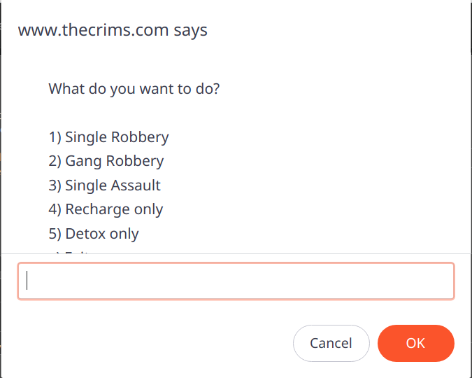

# The Crims Italian Bot V2

This is a new version of the bot [The Crims Italian Bot](https://github.com/grimaldello/the-crims-italian-bot) that I've developed to play the online game [The Crims](https://www.thecrims.com) without manually performing most of the tedious tasks of the game.

The bot V2 has been rewritten from the beginning.

Noteworthy improvements are:
- **Anti-logging mechanism** in order to emulate mouse click and movement (the previous bot lack of this). It can be surely improved, but the basics are in.
- **Added start menu** for selecting the bot action to perform 
- (For developers) **Typescript** as programming language in order to have better code organization

# First thing first
I have made this bot on my free time.
So do not expect the perfection from this bot :)

**You can obviously contribute on it in order to improve the bot.**

# Before run the bot
> :warning: Before run the bot make sure that the following points have been done:
> - **Single Robberies: checkbox Full Stamina must be checked**

# How to use the **bot**
You can find here on Github a [Releases](https://github.com/grimaldello/the-crims-italian-bot-v2/releases) ready to use.

In order to start the bot you need to:
- copy all the content of the file `release.js` in the clipboard (I suggest CTRL+A to select all and then CTRL+C to copy the selected text)
- open the console browser, usually using F12 or through the browser menu
- paste the content of the file `release.js` in the browser console
- press ENTER

The bot will prompt the action to do:


Insert the number of the action you want to perform and then press OK button.

The bot will start perform the selected action.

> :warning: **TO STOP the bot**, just refresh the browser. Do not perform the refresh inside rave, you could experience bad behavior :)

# Bot settings
The bot has some settings/parameters that can be customized.
To change the settings/parameters you have to search in the `release.js` file the following string:
```
let BotSettingsManager = class BotSettingsManager
```
and then change the values according your needs.

I know that this is not user friendly and can be improved, but it works :)

# Recharging
By default the bot will use a random rave in order to recharge.
You can set to use favorite rave by changing the following setting to `false`:
```
useRandomRaveForRecharge: false,
```
This way the bot will use the first favorite rave.
There's a fallback for this: if no favorite rave is found, it will use a random one.

# Detox
By default the bot will perform detox if current addiction is a random value in a range of min and a max value.
You can change the threshold by changing the following setting:
```
detox: {
    threshold: {
        min: 25,
        max: 65
    }
}
```
# Single Robbery
For single robbery the first thing to do is to execute manually the robbery you want to perform.

> :warning: **DO NOT FORGET to check Full Stamina checkbox before manually perform the robbery!** The bot currently doesn't work well without checking Full Stamina checkbox!

The bot automatically will perform the currently selected single robbery and when necessary it will recharge.

# Gang Robbery
For gang robbery you must be in a gang that is performing gang robbery (virtual or not).
Then the bot will press `Accept` or `Do the score` button automatically and also will recharge when necessary.

# Hunting
Hunting is basic at the moment.

You have to set the min and max respect for hitman and not hitman victim in the following settings:
```
hitman: {
    minRespect: 200,
    maxRespect: 100000
},
notHitman: {
    minRespect: 200,
    maxRespect: 100000
},
```
and the bot will start hunting and killing victims depending on the respect criteria.

You can also set a list of victims username or victims id to avoid to kill and exit instantly from the rave.
You can set usernames or ids list in the following settings:
```
victimUsernameToAvoidToKillList: ["USERNAME_1", "USERNAME_2", ... , "USERNAME_x"],
victimIdsToAvoidToKillList: ["ID_1", "ID_2", ... , "ID_X"]
```
For example to avoid to kill victim (and exit from rave) if username of victim is`foo` or `bar` or user victim with id `1234566789` is in rave:
```
victimUsernameToAvoidToKillList: ["foo", "bar"],
victimIdsToAvoidToKillList: ["123456789"]
```

# Local Development
If you want to develop locally the bot, first of all you need to install:
- `NodeJs` (>=18)

> It may be working also with other NodeJs version, but never tested

> If you already have a different version of Nodej installed, you can use [nvm](https://github.com/nvm-sh/nvm) for POSIX-compliant shell or [nvm-windows](https://github.com/coreybutler/nvm-windows) for Windows in order to install and manage multiple NodeJs and npm version on the same system.

Then clone the repository and install all the dependencies using the command (from the project root, the folder with `pacakge.json` file):
```
npm install
```
After the installation of the dependencies, to generate the `release.js` file that is needed to run the bot in the browser, use the following command:

```
npm run build
```
and a `dist` folder will be created with file `release.js` inside
